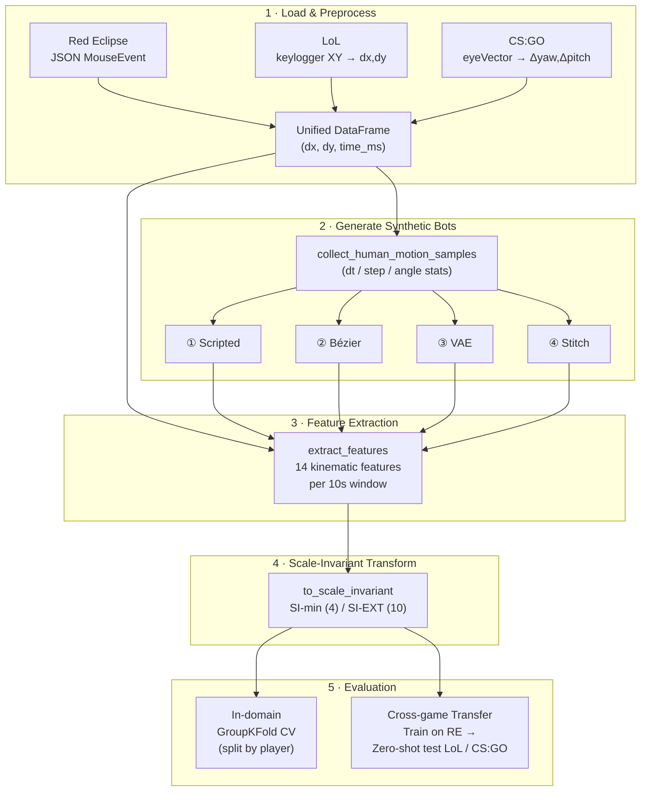

# Cross-Game Mouse Trajectory Bot Detection

## Project Structure

```
yxc1228/
├── notebooks/
│   ├── red_eclipse.ipynb
│   ├── lol.ipynb
│   ├── csgo.ipynb
│   └── cross_game.ipynb
│
├── src/
│   ├── config.py               # Paths, seeds, hyperparameters
│   ├── data.py                 # Data loaders: Red Eclipse, LoL, CS:GO
│   ├── features.py             # Feature extraction, windowing, scale-invariant transform
│   ├── bots.py                 # Stitch / smooth / Bézier bot generation
│   ├── vae_bot.py              # VAE architecture, training, generation
│   ├── evaluation.py           # GroupKFold, cross-game transfer, diagnostics
│   ├── artifacts_store.py      # Data / classifier load-save cache
│   └── plotting.py             # Trajectory visualisation
│
├── artifacts/                  # Cached outputs
│   ├── data/
│   ├── classifiers/
│   └── vae_weights/
│
├── data/                       # Raw game data (not committed)
│   ├── red_eclipse/
│   ├── lol/
│   └── CSGO/
│
├── docs/                       # Design docs, notes
├── requirements.txt
└── README.md
```

## Pipeline



## Datasets

| Game | Genre | Data source |
|------|-------|-------------|
| Red Eclipse (RE) | FPS | `data/red_eclipse/`, keylogger CSV (dx, dy, time), full game (~3 min) |
| CS:GO | FPS | `data/CSGO/`, eye-vector CSV converted to (Δyaw, Δpitch, time), Round 2+ alive (~3 min) |
| League of Legends (LoL) | MOBA | `data/lol/`, keylogger CSV, match-aligned 10-13 min window |

## Synthetic Bot Types

```
Most mechanical ◄─────────────────────────────────────────────────► Most human-like

 ① scripted          ② Bézier             ③ VAE                 ④ stitch
    rule-based         parametric-curve      learned generation     human-segment
    random walk        baseline                                     recombination

  "direction +       "humanised curve +    "segments learned      "every segment
   straight line      accel/decel"          from human             is real"
   + jitter"                                distribution"

 From scratch ◄───────────────────────────────────────────────────► Human-derived
```

All generators share one preparation step: `collect_human_motion_samples` (`src/bots.py`) extracts dt / step / angle statistics from the human traces, which each generator then samples from.

| Bot type | Method | Code | Call flow |
|----------|--------|------|----------------------|
| **Scripted** ("smooth") | Hold a sampled heading & step for 20-60 events with Gaussian jitter, then re-sample | `src/bots.py` | `estimate_smooth_params` → `generate_smooth_bot_game` |
| **Bézier** | Chain cubic Bézier strokes toward random targets, with ease-out spacing + perpendicular tremor | `src/bots.py` | `estimate_bezier_params` → `generate_bezier_bot_game` |
| **VAE** | Per-game MLP-VAE (z=12) generates 64-event segments, assembled via the stitch machinery | `src/vae_bot.py` | `ensure_vae_bundle` (load/train weights) → `generate_vae_bot_games` (decodes via `sample_vae_segments`, assembles with `stitch_bot_game`) |
| **Stitch** | Cut human traces into 1.5–2.5 s chunks, randomly re-concatenate into a new session | `src/bots.py` | `build_segments` (cut human traces) → `stitch_bot_game` |

## Extracted Features

| Feature | Code name | Description | In-domain | Cross-game raw |
|---------|-----------|-------------|:---------:|:--------------:|
| Average speed | `avg_speed` | Mean of step distance / time gap | ✓ | ✓ |
| Idle ratio | `idle_ratio` | Fraction of steps with distance < 1 | ✓ | ✓ |
| Average turning angle | `turn_angle_mean` | Mean \|Δheading\| between steps | ✓ | ✓ |
| Speed variation | `speed_std` | Std of per-step speed | ✓ | ✓ |
| Maximum speed | `speed_max` | Max per-step speed | ✓ | ✓ |
| Movement variation | `dist_std` | Std of per-step distance | ✓ | ✓ |
| Total movement | `total_movement` | Sum of step distances √(dx²+dy²) | ✓ | |
| Number of events | `n_events` | Count of mouse events | ✓ | |
| Average time gap | `mean_dt` | Mean interval between events | ✓ | |
| Subsegment efficiency | `efficiency_sub` | Mean straightness over 40-event chunks | ✓ | |
| Turning angle std | `turn_angle_std` | Std of \|Δheading\| | ✓ | |
| Vertical-horizontal ratio | `vh_ratio` | Σ\|dy\| / Σ\|dx\| | ✓ | |
| Direction-change rate | `dir_change_rate` | dx sign-flip rate | ✓ | |
| XY correlation | `xy_corr` | Pearson corr(dx, dy) | ✓ | |

## Scale-Invariant Features

| Name | Formula | Meaning | SI-min | SI-EXT |
|------|---------|---------|:------:|:------:|
| `speed_cv` | speed_std / avg_speed | Speed consistency (CV) | ✓ | ✓ |
| `speed_peak` | speed_max / avg_speed | Peak speed relative to average | ✓ | ✓ |
| `turn_angle_mean` | *(unchanged)* | Mean absolute heading change (rad) | ✓ | ✓ |
| `accel_cv` | std(Δspeed/Δt) / mean(\|Δspeed/Δt\|) | Acceleration irregularity (CV) | ✓ | ✓ |
| `turn_angle_std` | std(turn angles) | Variability of turning | | ✓ |
| `efficiency_sub` | mean path-efficiency over 40-event chunks | Local straightness | | ✓ |
| `vh_ratio` | Σ\|dy\| / Σ\|dx\| | Vertical vs horizontal motion | | ✓ |
| `dir_change_rate` | (# dx sign flips) / n_events | How often horizontal direction reverses | | ✓ |
| `xy_corr` | corr(dx, dy) | Axis coupling of steps | | ✓ |
| `step_autocorr` | 0.5·[corr(dx_t, dx_{t+1}) + corr(dy_t, dy_{t+1})] | Step-to-step persistence | | ✓ |

## Evaluation Protocol

- **Window size:** 10 seconds, minimum 30 events per window
- **In-domain:** GroupKFold cross-validation, split by player (no player appears in both train and test)
- **Cross-game:** train Random Forest on all source-game windows → zero-shot test on target-game windows
- **Threshold calibration:** set at 95th percentile of target-game human scores (≈5% FP), no bot labels needed
- **Reproducibility:** all randomness is seeded from `RNG_SEED = 42` in `src/config.py`

### Metrics

| Metric | What it measures |
|--------|------------------|
| **AUC** | Ranking quality (are bot scores higher than human scores) |
| **Cal detect @≈5% FP** | Detection rate at a threshold where ≤5% of real humans are flagged |
| **@0.5** | Detection / FP at the naive 0.5 cutoff (for reference only) |

## Artifacts

Cached intermediates so notebooks can skip regenerating bots / retraining detectors.

| Subdir | Contents | Naming |
|--------|----------|--------|
| `data/` | Feature tables (committed) + optional local traces | `<game>_{human\|bot}_{features\|traces}.csv` |
| `classifiers/` | Session-level RandomForest for cross-game transfer | `<train_game>_{raw\|si_min\|si_ext}_<bot_type>.joblib` |
| `vae_weights/` | Per-game VAE weights | `vae_re_v2.pt`, `vae_lol_v4.pt`, `vae_csgo_v2.pt` |

- **Games:** `re`, `lol`, `csgo` · **Bot types:** `stitch`, `smooth`, `bezier`, `vae`
- **Feature sets:** `raw` (7 cross-game), `si_min` (4), `si_ext` (10)
- **Committed for remote run:** `*_features.csv`, classifiers, VAE weights (~10MB). `*_traces.csv` stay local / gitignored (~2.5GB). Evaluation and `cross_game.ipynb` work from features alone.
- Pipeline notebooks load from cache if present, else build and save (`src.artifacts_store`). In-domain GroupKFold does not save per-fold models.
- VAE: `FORCE_RETRAIN = False` loads the files above. If the file is missing, it trains once and saves.

## Key API

Functions the notebooks call directly.

| Function | Module | Purpose |
|----------|--------|---------|
| `extract_features(mouse_df)` | `features` | One feature dict from a (dx, dy, time) trace, or `None` if too short |
| `to_scale_invariant(feat_df)` | `features` | Add SI columns (`speed_cv`, `speed_peak`, `accel_cv`, …) to a feature table |
| `build_window_feature_table(...)` | `features` | Slice traces into 10 s windows and extract features per window |
| `train_bot_detector(human_df, bot_df, cols)` | `evaluation` | 80/20 RandomForest train/test, returns `(model, accuracy)` |
| `evaluate_group_kfold_windows(...)` | `evaluation` | In-domain GroupKFold CV at window level, split by player, bots regenerated per fold |
| `diagnose_cross_game(tag, model, human_df, bot_df, cols)` | `evaluation` | Zero-shot transfer: AUC + calibrated detection at ≈5 % FP on the target game |
| `try_load_game_cache(game, split)` / `save_game_cache(...)` | `artifacts_store` | Read / write the per-game feature+trace CSV cache |
| `apply_bot_cache(game, cache, namespace)` | `artifacts_store` | Unpack a bot cache into the notebook variable names (`re_stitch_df`, …) |
| `train_or_load_bot_detector(..., train_game, feature_set, bot_type)` | `artifacts_store` | Load classifier from `artifacts/classifiers/` if present, else train and save |
| `load_classifier(train_game, feature_set, bot_type)` | `artifacts_store` | Load a saved classifier directly (used by `cross_game.ipynb`) |
| `ensure_vae_bundle(...)` | `vae_bot` | Load VAE weights, or train once and save if missing |

## Regenerating Caches

Everything under `artifacts/` is derived and can be rebuilt from raw data. To force a rebuild, delete the relevant file and re-run the owning notebook:

| To regenerate | Delete | Then run |
|---------------|--------|----------|
| One game's human/bot data | `artifacts/data/<game>_*` | That game's notebook |
| One classifier | `artifacts/classifiers/<game>_<featset>_<bot>.joblib` | `red_eclipse.ipynb` or `csgo.ipynb` |
| All classifiers for a game | `artifacts/classifiers/<game>_*` | Same as above |
| A VAE | Set `FORCE_RETRAIN = True` in the VAE cell (or delete the `.pt`) | That game's notebook |

Note that cached bots are frozen samples: deleting a bot data cache re-draws bots from the current generators, so downstream numbers can shift slightly even with the same seed.

## Setup

Requires Python 3.13.

```bash
python -m venv venv
source venv/bin/activate
pip install -r requirements.txt
```

Run the pipeline notebooks in order (each **Restart & Run All**):

1. `notebooks/red_eclipse.ipynb`: builds RE cache + RE classifiers
2. `notebooks/lol.ipynb`: builds LoL cache
3. `notebooks/csgo.ipynb`: builds CSGO cache + CSGO classifiers
4. `notebooks/cross_game.ipynb`: zero-shot transfer

`cross_game.ipynb` trains nothing itself. It only reads `artifacts/` produced by the other three, so those must run (or their artifacts must be present) first.

**Running without the raw `data/` directory** (e.g. from a fresh clone): only `cross_game.ipynb` is guaranteed to work, using the committed feature tables and classifiers. The three game notebooks read raw files directly (trajectory previews, segment pools, windowing), so they will fail without `data/`. The same applies to cache regeneration. Since `*_traces.csv` are not committed, anything deleted under `artifacts/` can only be rebuilt on a machine that has the raw data.

## Key Dependencies

| Package | Purpose |
|---------|---------|
| `numpy`, `pandas` | Data manipulation |
| `scikit-learn` | Random Forest, GroupKFold, metrics |
| `torch` | VAE training and inference |
| `matplotlib` | Plotting |
| `joblib` | Classifier save/load (`artifacts/classifiers/`) |
| `jupyterlab` | Running the notebooks |
